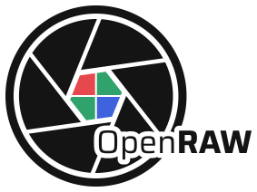
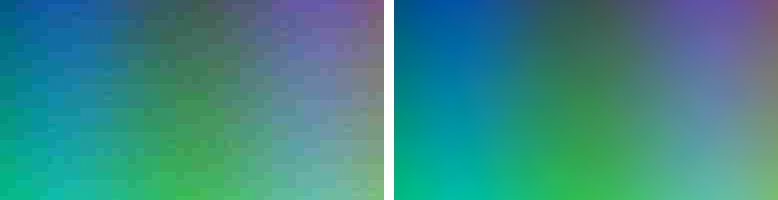
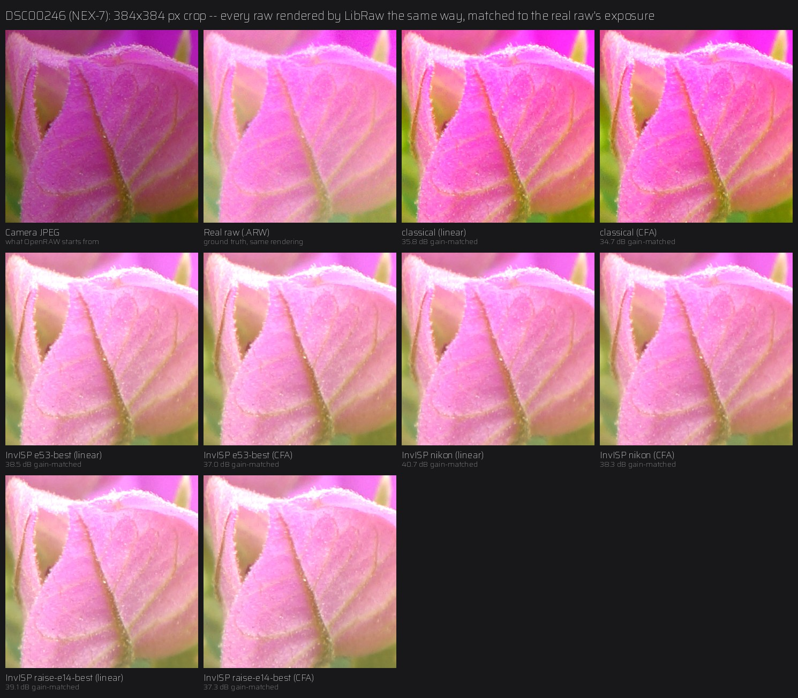

<p align="center">
  <picture>
    <source media="(prefers-color-scheme: dark)" srcset="assets/logo/openraw-logo-dark.svg">
    
  </picture>
</p>

# OpenRAW

**Turn JPEGs into editable raw DNGs** — more room to push exposure,
shadows, and colors in Lightroom, Luminar, darktable, RawTherapee, or any
raw editor, from cameras and phones that never gave you a raw file.

> **Status: alpha.** Usable and tested, but young.

## What it is — and what it isn't

A JPEG has already thrown information away: it's 8-bit, compressed, and
has the camera's tone curve and color baked in. **No tool can recover the
original sensor data from it**, and OpenRAW doesn't pretend to.

What it does is rebuild the JPEG into the form a raw editor works best
with: **16-bit linear light**, with compression artifacts cleaned up and
banding smoothed, packaged as a standard DNG. When you push the edit hard,
the damage that was already in the JPEG shows up as fine, natural grain
instead of hard banding and blocky steps — and you get your raw editor's
full toolset (white balance, highlight/shadow recovery, curves) working
on linear data instead of a baked image.



*Synthetic test image saved at JPEG quality 15 — left: blocking left in;
right: after OpenRAW's cleanup. Real photos saved at normal quality have far
milder artifacts; there, the main gain is the 16-bit linear headroom. See
[docs/how-it-works.md](docs/how-it-works.md).*

## Install

Requires Python 3.10+. Until there's a PyPI release:

```bash
git clone https://github.com/Swarce/OpenRAW.git
cd OpenRAW
pip install .
```

> If you already have `opencv-python` installed in the same environment,
> uninstall it first — it clashes with the `opencv-contrib-python-headless`
> package OpenRAW needs. A fresh virtual environment avoids this entirely.

## Use

```bash
openraw photo.jpg                     # -> photo.dng next to it
openraw photo.jpg -o edited/          # into a folder
openraw ~/Pictures/trip -r -o dngs/   # a whole folder tree, structure kept
openraw ~/Pictures/trip -r --jobs 2   # two photos at a time
openraw photo.jpg --layout cfa        # Bayer mosaic, like a camera raw (see below)
```

Batch runs are safe to interrupt and re-run: finished files are skipped
(use `--overwrite` to redo them), a broken file is reported without
stopping the rest, and a half-written DNG is never left behind.

### File size

DNGs are bigger than JPEGs — they hold far more precision. Defaults keep
an 18 MP photo around **50 MB**:

| Option | ~Size (18 MP) | Precision |
|---|---|---|
| `--bit-depth 16` | 76 MB | bit-exact |
| `--bit-depth 12` *(default)* | 50 MB | within 1/20 of a JPEG tonal step |
| `--bit-depth 10` | 37 MB | within 1/7 of a JPEG tonal step |
| `--compression none` | 108 MB | bit-exact, uncompressed |

`--layout cfa` writes a **Bayer mosaic** instead, like a real camera raw:
your editor runs its own demosaic, and the file is ~3x smaller (~18 MB).
Best for photographs; keep linear for screenshots, logos and graphics.
See [docs/dng-format.md](docs/dng-format.md) for measured quality.

All of these are lossless-JPEG-compressed DNGs (the same compression real
cameras use for raw), verified in both Adobe's DNG SDK and libraw.

### Metadata

Camera and lens info from the JPEG (make, model, lens, aperture, shutter,
ISO, focal length, orientation, capture time) is carried into the DNG when
present — never invented when absent. **GPS location is never copied**, and
neither is the folder path of your source files.

Run `openraw --help` for every option.

### Learned reconstruction (experimental)

`--invisp` swaps the classical stages for **InvISP**, an invertible neural
network. Needs PyTorch: `pip install ".[invisp]"`.

```bash
openraw photo.jpg --invisp-checkpoint pretrained/openraw-fivek-raise-e14-best.pth
```

`pretrained/` holds upstream's two single-camera models (`nikon.pth`,
`canon.pth`) and OpenRAW's own, trained on many pooled MIT-Adobe FiveK
cameras (`openraw-fivek-*.pth`) and on FiveK + RAISE (`openraw-fivek-raise-*.pth`,
training still in progress). You can also
train your own, locally or on Kaggle's free GPUs. What the models are and
how they differ: [docs/invisp.md](docs/invisp.md).

Measured against real RAW+JPEG pairs from a Sony NEX-7 (a camera no model
was trained on), InvISP comes much closer to the true raw than the
classical path — about 39–40 dB vs 36.5 dB after matching exposure, 28–30 dB
vs 24 dB as you'd see it ([details](docs/invisp.md#against-a-real-raw-sony-nex-7)):



## Tips

- **Editors apply their own sharpening and noise reduction to raw files.**
  Your camera's JPEG had sharpening baked in, so an unedited DNG can look
  slightly softer at first even though the pixels match. Add sharpening as
  you would for any raw file.
- **Quick-look viewers may show the small embedded preview**, not the full
  image. Judge quality at 100% inside your raw editor.

## Documentation

- [How it works](docs/how-it-works.md) — the reconstruction pipeline, stage by stage
- [DNG format notes](docs/dng-format.md) — how files are written, and what was tested against what
- [InvISP network](docs/invisp.md) — the optional learned reconstruction path
- [Training](docs/training.md) — training InvISP on MIT-Adobe FiveK
- [Training on Kaggle](docs/kaggle.md) — free GPUs, unattended, resumes across sessions
- [Contributing](CONTRIBUTING.md) · [Changelog](CHANGELOG.md)

## Credits & license

MIT licensed — see [LICENSE](LICENSE). Includes vendored code from
**InvISP** (Xing, Qian & Chen, CVPR 2021, MIT); full attribution in
[NOTICE.md](NOTICE.md).

The InvISP models are trained on the **MIT-Adobe FiveK** dataset
(Bychkovsky, Paris, Chan & Durand, CVPR 2011), and training can also use
**RAISE** (Dang-Nguyen, Pasquini, Conotter & Boato, ACM MMSys 2015). Both
datasets are licensed for research only, so the weights in `pretrained/` are
offered for **non-commercial research use**, unlike the code. Citations and
terms: [NOTICE.md](NOTICE.md#training-data).
