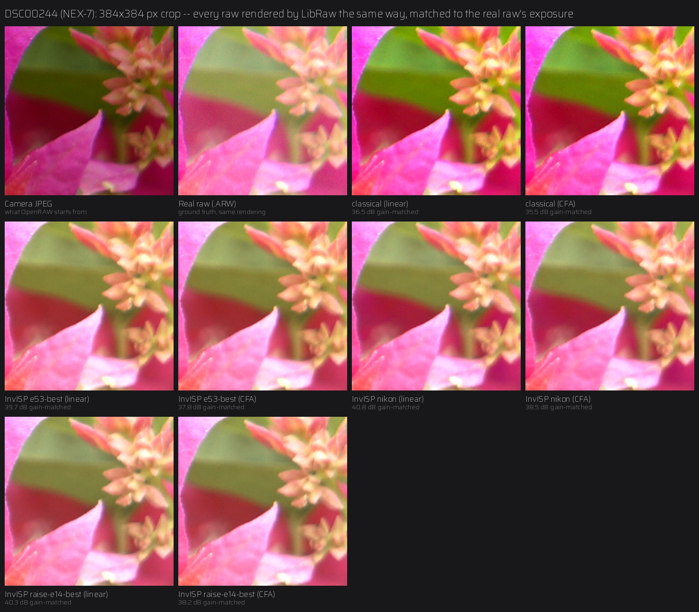
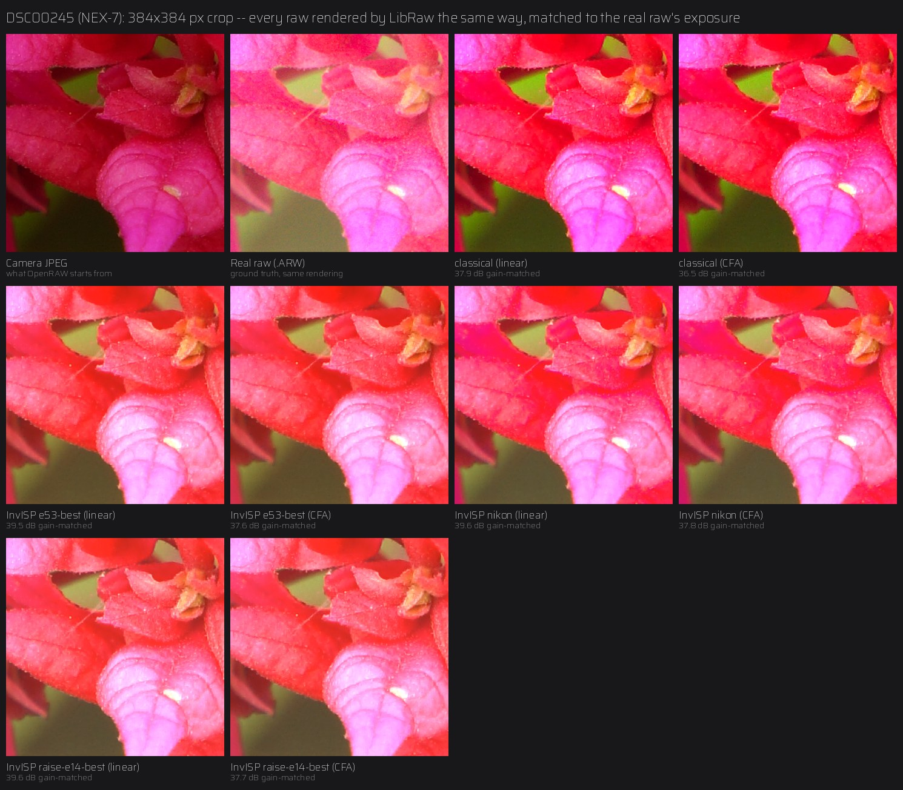
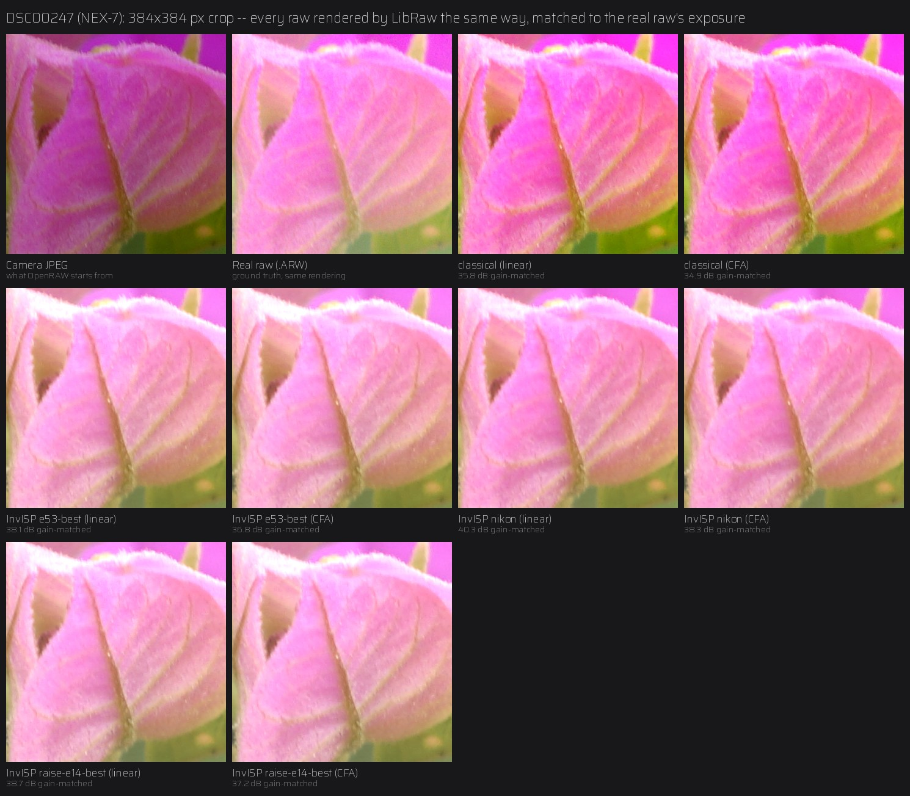

# InvISP: the optional learned path

`--invisp` replaces the classical deblock/chroma/tone-curve stages with
**InvISP** (Xing, Qian & Chen, *Invertible Image Signal Processing*, CVPR
2021) — an invertible neural network trained to map between RAW and
rendered sRGB. Full attribution in [NOTICE.md](../NOTICE.md).

> **Status: experimental.** It runs end to end and is covered by tests.
> Upstream ships two camera-specific models; you can train your own on any
> FiveK cameras ([training.md](training.md)). Models are scored on FiveK's
> held-out RAW files during training, and against real RAW+JPEG pairs from a
> camera none of them was trained on ([below](#against-a-real-raw-sony-nex-7)):
> there, InvISP comes much closer to the true raw than the classical path.

## Running it

```bash
pip install ".[invisp]"     # adds PyTorch

openraw photo.jpg --invisp-checkpoint pretrained/openraw-fivek-raise-e14-best.pth
openraw photo.jpg --invisp --invisp-camera NIKON_D700     # upstream model (or Canon_EOS_5D)
```

Run from the repository folder, or give the full path to the `.pth` file.
Weights aren't part of the installed package — see licensing below.

## The models in `pretrained/`

| File | Trained by | Training data | Training | Held-out raw PSNR | Sony NEX-7 (real raw) |
|---|---|---|---|---|---|
| `nikon.pth` | InvISP authors | FiveK Nikon D700 (414 images) | 300 epochs, batch 1 | 37.48 dB | **40.32 dB** |
| `canon.pth` | InvISP authors | FiveK Canon EOS 5D (650 images) | 300 epochs, batch 1 | 25.77 dB | — |
| `openraw-fivek-e35-best.pth` | OpenRAW | FiveK D700 + 5D (~1,070 images) | epoch 35, batch 1 | 38.32 dB | — |
| `openraw-fivek-e46-latest.pth` | OpenRAW | same | epoch 46, batch 1 | 38.32 dB | — |
| `openraw-fivek-e53-best.pth` | OpenRAW | same | epoch 53, batch 1, then 2 (two GPUs) | 38.55 dB | 38.95 dB |
| `openraw-fivek-raise-e14-best.pth` | OpenRAW | FiveK + RAISE (~1,930 images, 5 cameras) | `e53-best`, then 15 epochs on both, batch 2, weight averaging | **39.01 dB** | 39.42 dB |

*Held-out raw PSNR: every model scored by `tools/compare_models.py` on the same
40 held-out test images (512 px centre crops; FiveK Canon EOS 5D ×20, Nikon
D700 ×13, RAISE Nikon D7000 ×6, D90 ×1), JPEG → inverse network vs the true
raw. Sony NEX-7: the [real-raw test below](#against-a-real-raw-sony-nex-7),
gain-matched, linear DNG.*

All six are trained on MIT-Adobe FiveK images, and `openraw-fivek-raise-*`
also on RAISE; both datasets are licensed for research only, so the weights
are offered for **non-commercial research use** (the code is MIT). Citations
and terms: [NOTICE.md](../NOTICE.md#training-data).

**Which to use:** `openraw-fivek-raise-e14-best` scores highest on the
held-out set, ahead of upstream's `nikon.pth` on every camera there —
including the D700 `nikon.pth` was trained on — except the one RAISE D90
test image, and comes second on the Sony photos, 0.9 dB behind `nikon.pth`. It's the default suggestion; `nikon.pth` is worth trying
too. `canon.pth` scores far lower everywhere (a strong magenta cast).

What the differences mean in practice:

- **Single camera vs pooled.** The upstream models each learned *one*
  camera's rendering, and push every JPEG through that camera's behavior —
  ideal for a D700 or 5D JPEG, a guess for anything else. The OpenRAW models
  learned from many FiveK cameras at once, an average rendering that's a more
  reasonable default when a JPEG's source camera is unknown.
- **The FiveK run** (`openraw-fivek-*`). Held-out raw PSNR on its own,
  FiveK-only test set over the run:

  | Epoch | 17 | 35 | 53 | 71 | 89 | 107 | 125 |
  |---|---|---|---|---|---|---|---|
  | raw PSNR (dB) | 36.14 | 39.08 | **39.47** | 38.80 | 38.51 | 39.14 | 38.77 |

  It climbed until the last learning-rate drop (~epoch 49), then stayed
  around 38.5-39.1: snapshot jitter at a small learning rate plus likely some
  overfitting to ~1,070 images. It was stopped at epoch 139 of 182.
  (These numbers are on a different test set from the table's, so they're
  higher.)
- **The FiveK + RAISE run** (`openraw-fivek-raise-*`) continued from
  `e53-best` with ~860 RAISE images from three more Nikon sensors added,
  weight averaging and evaluation every 3 epochs. On its FiveK + RAISE test
  set: 38.51 (epoch 2) → 38.86 (8) → **39.01 (14)**, then 38.75-38.92 through
  epoch 26. The gain is largest on the new cameras (RAISE D7000: 37.00 dB vs
  34.12 for `e53-best` and 33.36 for `nikon.pth`). The run continues; later
  snapshots will be added if they score higher.
- **Upstream's models in OpenRAW.** OpenRAW's prepared data subtracts each
  sensor's black level and normalizes by each image's own white level, which
  upstream's training data didn't (see `data/README.md`); their scores here
  include that mismatch — the same one they meet inside OpenRAW. Upstream's
  paper numbers use a different setup and aren't comparable.

### Comparing models yourself

```bash
python tools/compare_models.py --data_path data/                    # every pretrained/*.pth
python tools/compare_models.py --data_path data/ pretrained/*.pth exps/<task>/checkpoint/best.pth
```

It scores each checkpoint on the same held-out images, crops and metric as
training's `[EVAL]` lines (so the numbers match `eval.csv`), with a
per-camera breakdown, and writes `compare/compare.md` + `compare.csv`. One
caveat for upstream's models: OpenRAW's prepared data subtracts each
sensor's black level and normalizes by each image's own white level, which
upstream's training data didn't (see `data/README.md`), so their raw PSNR
here includes that convention mismatch — the same one they face inside
OpenRAW. ~1 minute per model on a GPU, several on a CPU.

### Against a real raw: Sony NEX-7

The real test of OpenRAW: shoot RAW + JPEG, convert the camera's JPEG, and
compare with what the camera's own raw file contains. Four photos from a Sony
NEX-7 (24 MP, by the project's author; a camera in no model's training data),
measured with `tools/raw_pair_eval.py`: every DNG *and the real `.ARW`* is
rendered by the same raw converter (LibRaw: camera white balance, no
auto-brightening, linear sRGB), aligned, and compared on each photo's
sharpest 2048×2048 px region.

| Method | Layout | PSNR, gain-matched | gain-matched, display | PSNR as converted |
|---|---|---|---|---|
| classical | linear | 36.48 dB | 23.96 dB | 16.35 dB |
| classical | CFA | 35.39 dB | 23.61 dB | 16.29 dB |
| InvISP `openraw-fivek-e53-best` | linear | 38.95 dB | 28.55 dB | 29.68 dB |
| InvISP `openraw-fivek-e53-best` | CFA | 37.30 dB | 27.78 dB | 29.32 dB |
| InvISP `nikon.pth` (upstream) | linear | **40.32 dB** | **30.25 dB** | **32.48 dB** |
| InvISP `nikon.pth` (upstream) | CFA | 38.25 dB | 29.16 dB | 31.88 dB |
| InvISP `openraw-fivek-raise-e14-best` | linear | 39.42 dB | 29.34 dB | 31.64 dB |
| InvISP `openraw-fivek-raise-e14-best` | CFA | 37.62 dB | 28.45 dB | 31.15 dB |

*Means over the four photos; per photo in
[`examples/nex7_raw_pair_results.csv`](../examples/nex7_raw_pair_results.csv).*

- **Gain-matched** fits one gain per colour channel first, so exposure and
  white balance (which a JPEG doesn't record) are taken out; what remains is
  tone, colour and detail — the fairest single number. **Display** is the
  same comparison after sRGB gamma, which weighs shadows and midtones as you
  see them. **As converted** includes the exposure offset too.
- **InvISP beats the classical path clearly**, on every photo: +1.6 to
  +4.9 dB gain-matched, +2.9 to +7.3 dB in display terms. The classical path
  only undoes the sRGB curve, so it keeps the camera's contrast and
  saturation, and its brightness is far from the raw's (16 dB as converted).
  InvISP undoes the rendering itself.
- **Upstream's `nikon.pth` scored highest** overall, even though it learned
  a single different camera. OpenRAW's FiveK + RAISE model (`raise-e14`)
  closed most of the gap: 0.9 dB behind on average (was 1.4 dB for
  `e53-best`), level on DSC00245, 0.5-1.6 dB behind on the others, and
  0.1-0.6 dB ahead of `e53-best` on every photo. Why a single-camera model
  transfers this well to the Sony isn't known yet.
- **CFA costs 0.9–2.3 dB** against linear here: the editor's demosaic has to
  rebuild detail the linear DNG stores directly. Still well ahead of the
  classical path for InvISP.
- Four photos, one camera, one session, similar subjects (flowers, close
  up): a first real measurement, not a benchmark.






*Crops of each photo's most detailed area. Every raw-derived tile is rendered
the same way and matched to the real raw's exposure; the JPEG is shown as
the camera wrote it. Note how the raw is flatter and less saturated than the
JPEG — it has no tone curve until an editor applies one — and how closely
the InvISP outputs follow it, where the classical outputs keep the JPEG's
look.*

To measure your own camera: shoot RAW + JPEG and run

```bash
python tools/raw_pair_eval.py my_pairs/ --out results/ --crops --region 2048 \
    --checkpoint pretrained/openraw-fivek-raise-e14-best.pth --checkpoint pretrained/nikon.pth
```

(`--region 2048` keeps it to a few minutes per photo and model on a CPU;
without it the whole frame is used.)

Any checkpoint `train.py` writes also works with `--invisp-checkpoint`
(`best.pth`, `latest.pth`, `NNNN.pth`, or the full-state `latest_state.pth`).
A checkpoint missing any weight is an error: upstream loaded with
`strict=False`, which silently ignored mismatches — loading a full-state file
that way set 0 of 280 weights and ran a random network.

**Memory.** The network runs in 512 px tiles with a 96 px overlap
(`--invisp-tile`), giving the same result as whole-image inference (verified
to float rounding: each output pixel depends on input within 80 px, and the
measured effective reach is ~20 px) at ~1 GB peak memory for any photo size.
Whole-image inference (`--invisp-tile 0`) needs ~1.8 GB per megapixel —
~32 GB for an 18 MP photo — which is why it isn't the default.

Expect colors to differ from the classical path: InvISP reconstructs its
learned approximation of the chosen camera's sensor-native response, not
an sRGB-preserving transform. Each upstream checkpoint is camera-specific (upstream
says so explicitly); a JPEG from any other camera is still reconstructed
through that camera's learned behavior. A model trained on several pooled
cameras learns an average behavior instead, which is arguably the better
fit when a JPEG's source camera is unknown.

## What's in the repo

- **`openraw/third_party/invisp/`** — InvISP's own source, vendored
  (MIT): the `InvISPNet` architecture (affine coupling blocks with
  learnable invertible 1×1 convolutions) and its differentiable JPEG
  simulator. One line is patched: `torch.qr` → `torch.linalg.qr`, because
  current PyTorch removed `torch.qr` outright; the value it computes is
  overwritten by the checkpoint on load, so this can't affect results.
  `torch.lu`/`torch.lu_unpack` a few lines below are deprecated (they warn)
  but still work on PyTorch 2.14; if a future release removes them, the
  same `torch.linalg` swap applies, for the same reason.
- **`pretrained/canon.pth`, `pretrained/nikon.pth`** — upstream's official
  checkpoints, verified byte-identical (md5) to upstream.
- **`pretrained/openraw-fivek-*.pth`** — trained by OpenRAW with this repo's
  `train.py` (see the table above).
- **`openraw/invisp_bridge.py`** — our own glue code. The subtle part:
  the checkpoints were trained with upstream's `--gamma` flag, so the
  network's "RAW" output is gamma-compressed, and the bridge undoes that
  before handing linear data to the shared `bitdepth.py`/`dng_writer.py`
  stages.
- **`openraw/ml/`** — superseded: a from-scratch NumPy demo of the same
  architecture class written before the real source was available. Kept
  only for its exact-invertibility tests; don't build on it.

## Open questions before this leaves "experimental"

- **Licensing of weights.** All four checkpoints were trained on MIT-Adobe
  FiveK, which has its own usage terms (upstream's are distributed from an
  MIT repository; OpenRAW's are in this repository). Check those terms
  before the repository or its weights are made public.
- **Evaluation.** Training scores models on FiveK's held-out RAW files
  (raw PSNR, see [training.md](training.md)). Still missing: the same score
  for the upstream checkpoints as a baseline, and RAW+JPEG pairs from other,
  modern cameras.
- **Batch size.** Multi-GPU training uses an effective batch size above
  upstream's 1; the held-out score is how to check that it doesn't hurt.
