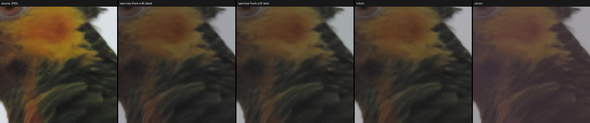

# InvISP: the optional learned path

`--invisp` replaces the classical deblock/chroma/tone-curve stages with
**InvISP** (Xing, Qian & Chen, *Invertible Image Signal Processing*, CVPR
2021) — an invertible neural network trained to map between RAW and
rendered sRGB. Full attribution in [NOTICE.md](../NOTICE.md).

> **Status: experimental.** It runs end to end and is covered by tests.
> Upstream ships two camera-specific models; you can train your own on any
> FiveK cameras ([training.md](training.md)). Models are scored on FiveK's
> held-out RAW files during training, but not yet against RAW+JPEG pairs from
> other cameras. The classical path is the default for good reason.

## Running it

```bash
pip install ".[invisp]"     # adds PyTorch

openraw photo.jpg --invisp-checkpoint pretrained/openraw-fivek-e46-latest.pth
openraw photo.jpg --invisp --invisp-camera NIKON_D700     # upstream model (or Canon_EOS_5D)
```

Run from the repository folder, or give the full path to the `.pth` file.
Weights aren't part of the installed package — see licensing below.

## The models in `pretrained/`

| File | Trained by | Training data | Training | Held-out raw PSNR |
|---|---|---|---|---|
| `nikon.pth` | InvISP authors | Nikon D700 only (414 images) | 300 epochs, batch 1 | not yet measured |
| `canon.pth` | InvISP authors | Canon EOS 5D only (650 images) | 300 epochs, batch 1 | not yet measured |
| `openraw-fivek-e35-best.pth` | OpenRAW | pooled FiveK cameras (~1,070 images) | epoch 35 of 182, batch 1 | **39.08 dB** |
| `openraw-fivek-e46-latest.pth` | OpenRAW | same | epoch 46 of 182, batch 1 | not yet measured |

What the differences mean in practice:

- **Single camera vs pooled.** The upstream models each learned *one*
  camera's rendering, and push every JPEG through that camera's behavior —
  ideal for a D700 or 5D JPEG, a guess for anything else. The OpenRAW models
  learned from many FiveK cameras at once, an average rendering that's a more
  reasonable default when a JPEG's source camera is unknown.
- **`e35-best` vs `e46-latest`** are snapshots of the same, still-running
  training. `e35-best` is the best model the held-out evaluation has scored
  (raw PSNR 39.08 dB, up from 36.14 at epoch 17). `e46-latest` has trained 11
  epochs more — including after a learning-rate drop at epoch 30 — and the
  scores were still rising, so it is probably better, but it hasn't been
  evaluated yet. Prefer `e46-latest` for trying things; `e35-best` is the one
  with a measured number behind it.
- **Comparability.** "Held-out raw PSNR" is OpenRAW's own evaluation (real
  FiveK JPEG → inverse network → compared with the true raw, on 512 px centre
  crops of the test split). The upstream models haven't been scored on it
  yet, so the table can't rank OpenRAW's models against them. Upstream's paper
  numbers use a different setup and aren't comparable either.
- Training continues; these files will be replaced by later snapshots, then a
  final model.

### On a real photo



*A 5 MP photo, most likely from a Nikon Coolpix compact (its `DSCN` file
naming; the EXIF was stripped), so neither of the upstream models' training
cameras: the source JPEG, then each model's raw output, rendered without a
tone curve.*

The OpenRAW models land between the two upstream ones — `e35-best` is
closest to `nikon.pth` — while `canon.pth` adds a visible magenta cast: the
single-camera bias in action. All four look flatter than the JPEG; that's
expected, since a raw has no tone curve or saturation boost until your editor
applies one. Without a true raw for this photo, it shows how the models
differ, not which one is right.

Any checkpoint `train.py` writes also works with `--invisp-checkpoint`
(`best.pth`, `latest.pth`, `NNNN.pth`, or the full-state `latest_state.pth`).
A checkpoint missing any weight is an error: upstream loaded with
`strict=False`, which silently ignored mismatches — loading a full-state file
that way set 0 of 280 weights and ran a random network.

**Memory.** The network runs in 512 px tiles with a 96 px overlap
(`--invisp-tile`), giving the same result as whole-image inference (verified
to float rounding: each output pixel depends on input within 80 px, and the
measured effective reach is ~20 px) at ~1 GB peak memory for any photo size.
Whole-image inference (`--invisp-tile 0`) needs ~1.8 GB per megapixel —
~32 GB for an 18 MP photo — which is why it isn't the default.

Expect colors to differ from the classical path: InvISP reconstructs its
learned approximation of the chosen camera's sensor-native response, not
an sRGB-preserving transform. Each upstream checkpoint is camera-specific (upstream
says so explicitly); a JPEG from any other camera is still reconstructed
through that camera's learned behavior. A model trained on several pooled
cameras learns an average behavior instead, which is arguably the better
fit when a JPEG's source camera is unknown.

## What's in the repo

- **`openraw/third_party/invisp/`** — InvISP's own source, vendored
  (MIT): the `InvISPNet` architecture (affine coupling blocks with
  learnable invertible 1×1 convolutions) and its differentiable JPEG
  simulator. One line is patched: `torch.qr` → `torch.linalg.qr`, because
  current PyTorch removed `torch.qr` outright; the value it computes is
  overwritten by the checkpoint on load, so this can't affect results.
  `torch.lu`/`torch.lu_unpack` a few lines below are deprecated (they warn)
  but still work on PyTorch 2.14; if a future release removes them, the
  same `torch.linalg` swap applies, for the same reason.
- **`pretrained/canon.pth`, `pretrained/nikon.pth`** — upstream's official
  checkpoints, verified byte-identical (md5) to upstream.
- **`pretrained/openraw-fivek-*.pth`** — trained by OpenRAW with this repo's
  `train.py` (see the table above).
- **`openraw/invisp_bridge.py`** — our own glue code. The subtle part:
  the checkpoints were trained with upstream's `--gamma` flag, so the
  network's "RAW" output is gamma-compressed, and the bridge undoes that
  before handing linear data to the shared `bitdepth.py`/`dng_writer.py`
  stages.
- **`openraw/ml/`** — superseded: a from-scratch NumPy demo of the same
  architecture class written before the real source was available. Kept
  only for its exact-invertibility tests; don't build on it.

## Open questions before this leaves "experimental"

- **Licensing of weights.** All four checkpoints were trained on MIT-Adobe
  FiveK, which has its own usage terms (upstream's are distributed from an
  MIT repository; OpenRAW's are in this repository). Check those terms
  before the repository or its weights are made public.
- **Evaluation.** Training scores models on FiveK's held-out RAW files
  (raw PSNR, see [training.md](training.md)). Still missing: the same score
  for the upstream checkpoints as a baseline, and RAW+JPEG pairs from other,
  modern cameras.
- **Batch size.** Multi-GPU training uses an effective batch size above
  upstream's 1; the held-out score is how to check that it doesn't hurt.
